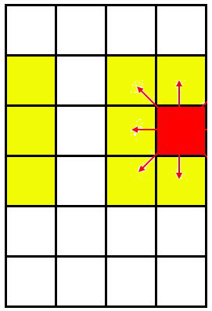

# Conway's Game of Life

The Game of Life, also known simply as Life, is a cellular automaton devised by the British mathematician John Horton Conway in 1970.

The "game" is a zero-player game, meaning that its evolution is determined by its initial state, requiring no further input. One interacts with the Game of Life by creating an initial configuration and observing how it evolves.

## Rules

The universe of the Game of Life is a two-dimensional orthogonal grid of square cells, each of which is in one of two possible states, live or dead. Every cell interacts with its eight neighbors, which are the cells that are directly horizontally, vertically, or diagonally adjacent.

If the cell is on the fringe of the grid it laps over to the other side:

At each step in time, the following transitions occur:

* Any live cell with fewer than two live neighbours dies, as if caused by underpopulation.
* Any live cell with more than three live neighbours dies, as if by overcrowding.
* Any live cell with two or three live neighbours lives on to the next generation.
* Any dead cell with exactly three live neighbours becomes a live cell.

The initial pattern constitutes the seed of the system. The first generation is created by applying the above rules simultaneously to every cell in the seed. Births and deaths happen simultaneously, and the discrete moment at which this happens is sometimes called a tick. The rules continue to be applied repeatedly to create further generations.

## References

* [John Conway Talks about the Game of Life Problem](https://youtu.be/FdMzngWchDk)
* [Game of Life Rules](https://github.com/marcoemrich/game-of-life-rules/blob/master/gol_rules.pdf)
* [Wikipedia on Conways Game Of Life](https://en.wikipedia.org/wiki/Conway%27s_Game_of_Life)  
